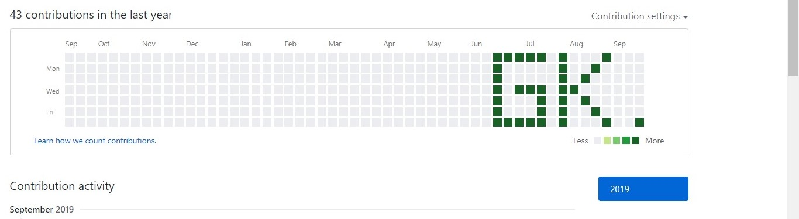

GitHub-Art
====================

## An application that allows users and artists to permanently seal their artwork using git commits!

#### An Example Result:

[Link](https://github.com/test302?tab=overview&from=2018-12-01&to=2018-12-31)

# Usage

1. Login in to your git account from the terminal
2. Make an empty repo on GitHub or any other git based VCS provider and set it as `remote` from your local machine
3. Place the contents of this repository in the local directory
4. Make sure you have one of the newer versions of `python 3` installed and install all the necessary packages with `pip install -r requirements.txt` with the right version of `pip`
5. Run `gui.py` with `python gui.py`, and click to make art!, You can click a day more than once to change the shade.
6. Click `Submit` and wait for the script to run
7. Run `git push -u origin master` to upload your art!

# Future plans

- Add more features and functionality to the GUI like save and load art etc
- Change the year where the art will be saved to
- Test on other VCS providers like GitLab, BitBucket etc.
